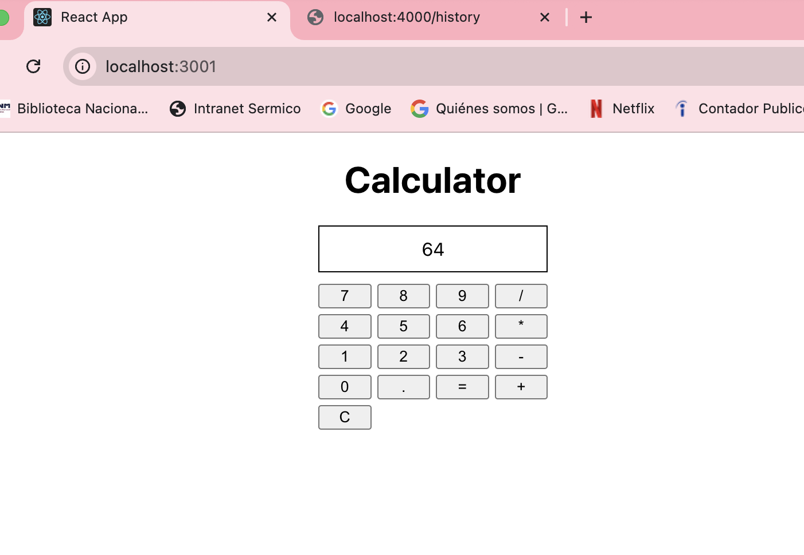
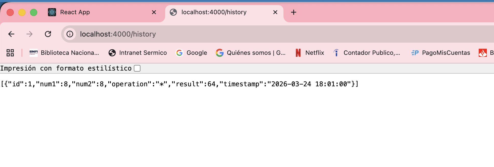

# Version en español "Calculadora Full Stack"

Este proyecto es una calculadora desarrollada con buenas prácticas de programación orientada a objetos e interfaces en TypeScript, con un backend en Node.js + Express y una base de datos SQLite. El frontend está hecho en React.

## Finalidad

El objetivo es mostrar cómo diseño una solución completa, modular y escalable, aplicando patrones de diseño, separación de responsabilidades y buenas prácticas.  
Ideal para que reclutadores y líderes técnicos puedan evaluar mi forma de estructurar y conectar un proyecto full stack, más allá del tamaño del desafío.

---

## Características principales

- **Frontend en React**: Interfaz de usuario simple y funcional.
- **Backend en Node.js + TypeScript + Express**: Lógica de negocio desacoplada, orientada a interfaces y estrategias.
- **Base de datos SQLite**: Persistencia de operaciones e historial.
- **API REST**: Comunicación clara entre front y back.
- **Historial de operaciones**: Consultable desde el backend y preparado para integrarse al frontend.
- **Código modular y escalable**: Fácil de mantener y extender.

---

## Estructura del proyecto

calculadora/
│
├── server.ts # API Express (fuera de src)
├── tsconfig.json
├── package.json
├── calculadora.db # Base de datos SQLite
├── src/
│ ├── Calculator.ts
│ ├── AdittionStrategy.ts
│ ├── SubstractionStrategy.ts
│ ├── MultiplicationStrategy.ts
│ ├── DivisionStrategy.ts
│ ├── MemoryStorage.ts
│ ├── database.ts
│ └── ...otros archivos
└── frontend/
└── src/
└── App.tsx


---

## Cómo ejecutar el proyecto

1. **Clona el repositorio y entra a la carpeta:**
   ```sh
   git clone <url-del-repo>
   cd calculadora

2. **Instala las dependencias del backend:**

  npm install

3. **Instala las dependencias del frontend:**

  cd frontend
  npm install
  cd ..

4. **Inicia el backend:**
  
  npx ts-node server.ts

Verás: API listening on http://localhost:4000

5. **Inicia el frontend:**

  cd frontend
  npm start

Abre el navegador en http://localhost:3000 (o el puerto que indique).

6. **Usa la calculadora y consulta el historial:**



  Realiza operaciones en el frontend.



  Consulta el historial en http://localhost:4000/history.

## Explicación técnica

--> Backend:

Implementa el patrón estrategia para las operaciones matemáticas (POO)
Expone dos rutas principales:
POST /calculate: recibe los datos, ejecuta la operación usando la estrategia adecuada, guarda el resultado en la base y responde al frontend.
GET /history: devuelve el historial de operaciones guardadas.
Usa SQLite para persistencia, con un archivo de conexión y setup automático.

--> Frontend:

Permite ingresar números y operaciones, y muestra el resultado.
Se comunica con el backend usando fetch.
Preparado para mostrar el historial (ver TODO).

## TODO / Mejoras futuras

 -> Mostrar el historial de operaciones en el frontend (iterar sobre /history y renderizarlo en React).
 -> Agregar tests unitarios para la lógica de la calculadora y las estrategias.
 -> Mejorar el diseño visual del frontend.
 -> Agregar manejo de errores y validaciones más robustas.
 -> Desplegar el proyecto en un entorno cloud (Heroku, Vercel, etc).

Autor
Laura Eroles

Si eres recruiter o TL y quieres ver cómo pienso y estructuro soluciones, este proyecto es una muestra de mi enfoque modular, escalable y orientado a buenas prácticas.


# English version "Full Stack Calculator"

This project is a calculator built using solid Object-Oriented Programming practices and interfaces in TypeScript, with a Node.js + Express backend and a SQLite database. The frontend is developed in React.

## Purpose

The goal of this project is to demonstrate how I design a complete, modular, and scalable solution by applying design patterns, separation of concerns, and best practices.
It’s intended for recruiters and technical leaders to evaluate how I structure and connect a full stack application beyond the size of the challenge itself.

## Key Features
- **React Frontend:** Simple and functional user interface.
- **Node.js + TypeScript + Express Backend:** Decoupled business logic using interfaces and strategy patterns.
- **SQLite Database:** Stores operations and history.
- **REST API:** Clear communication between frontend and backend.
- **Operations History:** Accessible from the backend and ready for frontend integration.
- **Modular & Scalable Codebase:** Easy to maintain and extend.

## Project Structure

calculadora/
│
├── server.ts            # Express API (outside src)
├── tsconfig.json
├── package.json
├── calculadora.db       # SQLite database
├── src/
│   ├── Calculator.ts
│   ├── AdditionStrategy.ts
│   ├── SubtractionStrategy.ts
│   ├── MultiplicationStrategy.ts
│   ├── DivisionStrategy.ts
│   ├── MemoryStorage.ts
│   ├── database.ts
│   └── ...other files
└── frontend/
    └── src/
        └── App.tsx

## How to Run the Project

1. **Clone the repository and navigate into the folder:**


git clone <repo-url>
cd calculadora

2. **Install backend dependencies:**

npm install

3. **Install frontend dependencies:**

cd frontend
npm install
cd ..

4. **Start the backend:**

npx ts-node server.ts

You should see:
API listening on http://localhost:4000

5. **Start the frontend:**

cd frontend
npm start

Open your browser at:
http://localhost:3000 (or the port specified).

6. **Use the calculator and check the history:**


Perform operations on the frontend.


Check the operations history at:
http://localhost:4000/history


## Technical Overview

--> Backend
Implements the Strategy Pattern for mathematical operations (OOP).
Exposes two main endpoints:
POST /calculate: Receives input data, executes the operation using the appropriate strategy, stores the result, and returns it to the frontend.
GET /history: Returns the stored operations history.
Uses SQLite for persistence with automatic setup and connection handling.

--> Frontend
Allows users to input numbers and select operations.
Displays results dynamically.
Communicates with the backend using fetch.
Prepared to display history (see TODO section).

## TODO / Future Improvements

 -> Display operations history in the frontend (fetch /history and render it in React).
 -> Add unit tests for calculator logic and strategies.
 -> Improve frontend UI/UX design.
 -> Implement better error handling and validations.
 -> Deploy the project to a cloud environment (Heroku, Vercel, etc.).

Author
Laura Eroles

If you're a recruiter or tech lead and want to understand how I think and structure solutions, this project reflects my approach: modular, scalable, and aligned with best practices.